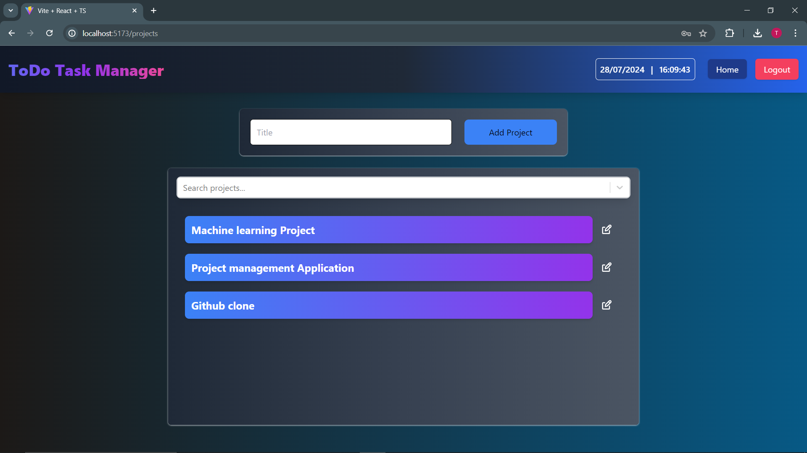
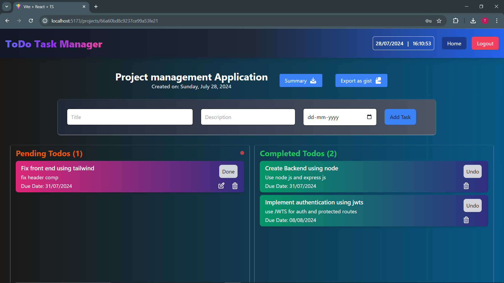
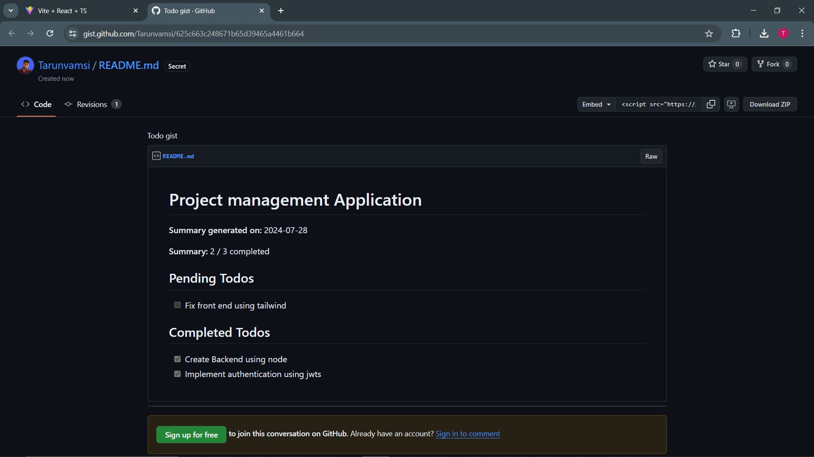

# Todo-Typescript

Welcome to the Todo-Typescript project! This README will guide you through setting up and running the project.

## Demo

For a walkthrough of the Application , check out the recorded demo video: [View on YouTube](https://www.youtube.com/watch?v=yN5TduKOPMQ)

## Getting Started

### 1. Clone the Repository

Start by cloning the repository:

    git clone https://github.com/Tarunvamsi/Todo-Typescript.git

### 2. Configure Environment Variables

#### UI Setup

1. Navigate to the `ui` directory:

    ```bash
    cd ui
    ```

2. Create a `.env` file by copying from `.env.example`:

    ```bash
    cp .env.example .env
    ```

3. Generate a [GitHub Gist Access Token](https://github.com/settings/personal-access-tokens/new) and add it to your `.env` file under the `GITHUB_GIST_ACCESS_TOKEN` variable.

#### Server Setup

1. Navigate to the `server` directory:

    ```bash
    cd ../server
    ```

2. Configure the MongoDB URL:

   The connection string should look like this:

    ```bash
    MONGO_DB_URL=mongodb+srv://<username>:<password>@cluster0.example.mongodb.net/
    ```

   - `<username>`: Your MongoDB username.
   - `<password>`: Your MongoDB password.
   - `cluster0.example.mongodb.net`: Your MongoDB cluster address (may vary based on your MongoDB provider).
   - `<your-database>`: The name of the database you want to connect to (you can create a new database if needed).


3. Configure the JWT Secret:

   - Create a secret key for JWT and add it to your `.env` file under `JWT_SECRET`.

### 3. Install Dependencies

#### Frontend

1. Go to the `ui` directory:

    ```bash
    cd ui
    ```

2. Install the required dependencies:

    ```bash
    npm install
    ```

3. Start the frontend development server:

    ```bash
    npm run dev
    ```

#### Backend

1. Open a new terminal and navigate to the `server` directory:

    ```bash
    cd server
    ```

2. Install the required dependencies:

    ```bash
    npm install
    ```

3. Start the backend server:

    ```bash
    npm start
    ```

### 4. Access the Application

Open your browser and go to `http://localhost:5173` to view the app.

### Screenshots
- Signup page
  


- Projects list page
  


- Todos list page
  


- Private Gist (Project Summary)
  

